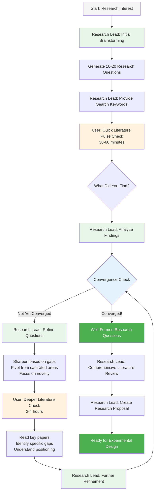

# Iterative Research Workflow: Brainstorming ↔ Literature Loop

## Overview

The BMAD AI Research workflow features a **critical iterative loop** between brainstorming and literature review. This is how great research questions are born.

Unlike software development (which is more linear), research ideation is **cyclical and iterative** - ideas inform literature searches, literature informs refined ideas, refined ideas prompt deeper literature dives, and so on.

## The Iterative Loop



## Phase Breakdown

### Phase 1: Initial Brainstorming
**Agent:** Research Lead
**Duration:** 30-60 minutes
**Output:** research-brainstorming-session-results.md with 10-20 initial research questions

**What Happens:**
- Use *brainstorm command with Research Lead
- Explore research interests broadly
- Generate research questions without constraints
- Identify what's interesting, confusing, or worth investigating
- Don't worry about novelty yet - generate ideas freely

**Example Questions Generated:**
- "Can transformers handle sequences longer than 10K tokens efficiently?"
- "Why do vision models fail on out-of-distribution data?"
- "How can we make reinforcement learning more sample-efficient?"

### Phase 2: Initial Literature Pulse Check
**Who:** User (with guidance from Research Lead)
**Duration:** 30-60 minutes
**Tool:** Google Scholar, arXiv, Semantic Scholar

**What to Do:**
1. Research Lead provides search keywords for your top 5 ideas
2. Quick search - don't read papers deeply yet
3. Note for each idea:
   - Has this been done? (Yes/No/Partially)
   - How saturated is this area? (Lots of papers / Some / Few)
   - Did you find interesting related work?
   - Any obvious gaps?

**What NOT to Do:**
- Don't read papers deeply yet (too early)
- Don't write literature review (too early)
- Don't give up on ideas that exist (might be unsolved aspects)

**Output:** Brief notes on what exists and what might be open

### Phase 3: Iterative Refinement Loop
**Agents:** Research Lead
**Iterations:** Typically 2-4 cycles
**Total Duration:** 1-2 weeks

#### Iteration Cycle (Repeat Until Converged)

**Step 1: Analyze Literature Findings** (Research Lead, 30 mins)
- Review what user found
- Identify patterns:
  - Which areas are saturated?
  - Where are the gaps?
  - What's surprisingly understudied?
  - What opportunities emerged?

**Step 2: Refine Research Questions** (Research Lead, 30-60 mins)
- Use *refine-questions command
- Sharpen vague questions into specific ones
- Pivot away from saturated areas
- Combine ideas in novel ways
- Focus on defensible novelty
- Assess feasibility realistically
- Update brainstorming document

**Example Refinement:**
- Before: "Can transformers handle longer sequences?"
- After: "Can attention be approximated with O(N) complexity while maintaining quality on sequences up to 100K tokens?"

**Step 3: Deeper Literature Check** (User, 2-4 hours)
- Focus on refined directions
- Read 5-10 key papers
- Understand:
  - What exactly has been done?
  - What are the stated limitations?
  - What do future work sections suggest?
  - What gaps do YOU see?

**Step 4: Further Refinement** (Research Lead, 30-60 mins)
- Incorporate deep literature understanding
- Formulate specific testable hypotheses
- Position against existing work
- Assess impact if successful

#### Convergence Criteria

**Ready to Move Forward When:**
- ✅ Research questions are **specific and testable**
- ✅ Gaps in literature are **clearly identified**
- ✅ Novelty is **defensible** (not just "no one did exactly this")
- ✅ Feasibility is **reasonable** (can actually test this)
- ✅ Impact is **significant** (would advance the field)
- ✅ You're **excited** about pursuing this

**NOT Ready If:**
- ❌ Questions still vague ("improve X" isn't testable)
- ❌ Literature gaps unclear or unconvincing
- ❌ Novelty is just minor tweaks
- ❌ Would require impossible resources
- ❌ Success wouldn't matter to anyone
- ❌ You're pursuing it just because it's open (not actually interesting)

### Phase 4: Comprehensive Literature Review
**Agent:** Research Lead
**Duration:** 1-2 weeks
**Output:** literature-review.md

**Now That Direction is Clear:**
- Systematic literature search
- Read 20-50 papers thoroughly
- Organize by themes (not chronologically)
- Document gaps that YOUR research addresses
- Position your work clearly
- This becomes foundation for paper's Related Work section

### Phase 5: Research Proposal
**Agent:** Research Lead
**Duration:** 1-2 weeks
**Output:** research-proposal.md

**Creates:**
- Problem statement (grounded in literature gaps)
- Research questions and hypotheses (from iterations)
- Proposed approach (novel contribution)
- Expected contributions (what advances the field)
- Experimental plan (how to validate)

**This feeds into Experimental Architecture → Implementation → Paper**

## Why This Loop Matters

### Without Iteration:
- ❌ Ideas might already be fully solved
- ❌ Questions too vague to test
- ❌ Miss novelty opportunities
- ❌ Waste months on dead ends
- ❌ Weak positioning in paper

### With Iteration:
- ✅ Ideas grounded in reality
- ✅ Questions specific and testable
- ✅ Clear novelty and gaps identified
- ✅ Save months of wasted effort
- ✅ Strong positioning from day one
- ✅ Reviewers see clear contributions

## Typical Timeline

### Iteration 1:
- Initial brainstorm: 1 hour
- Quick lit check: 1 hour
- Refinement: 30 mins
- **Total: ~2.5 hours**

### Iteration 2:
- Deeper lit check: 3 hours
- Refinement: 1 hour
- **Total: ~4 hours**

### Iteration 3:
- Focused reading: 4 hours
- Final refinement: 1 hour
- **Total: ~5 hours**

### Complete Loop:
- Initial to converged: **1-2 weeks** (part-time)
- But saves **months** of pursuing wrong directions

## Real Example

### Initial Idea (Iteration 0):
"Make transformers more efficient"

**Problem:** Too vague, thousands of papers

### After Iteration 1:
"Reduce attention complexity from O(N²) to O(N) for long sequences"

**Refinement:** More specific, but still saturated (many papers)

### After Iteration 2:
"Can we maintain full attention quality with O(N) complexity by using learned sparse patterns?"

**Refinement:** Specific approach, some related work but gaps identified

### After Iteration 3:
"Can learned sparse attention patterns adapt to different sequence types (text vs. time-series vs. code) while maintaining O(N) complexity and <5% quality degradation vs. full attention on sequences up to 64K tokens?"

**Final:** Highly specific, testable, novel angle, clear evaluation criteria

## Tips for Success

### During Brainstorming:
- Generate quantity first, filter later
- Wild ideas are good - they can become tame
- Don't self-censor based on perceived feasibility
- Ask "What if...?" questions
- Look for combinations not tried

### During Literature Search:
- Use citation trails (papers cite papers)
- Look for survey papers for field overview
- Check recent conference proceedings (last 1-2 years)
- Read "Future Work" and "Limitations" sections
- Papers With Code shows what has implementations

### During Refinement:
- Make questions increasingly specific
- Add quantitative criteria where possible
- Consider: "How would I test this?"
- Consider: "Would anyone care about this result?"
- Don't abandon ideas too quickly - refine them

### Knowing When to Converge:
- You have 2-3 **well-formed** research questions
- You can defend their novelty
- You know the related work landscape
- You're excited to pursue this
- Feasibility is reasonable

## Common Pitfalls

### Converging Too Early:
- Haven't checked literature thoroughly
- Questions still vague
- Novelty unclear
- **Result:** Waste months on non-contribution

### Iterating Forever:
- Perfectionism
- Fear of commitment
- Every paper spawns new doubts
- **Result:** Never start research

### Sweet Spot:
- **2-4 iterations** is typical
- **1-2 weeks** total time
- **Well-formed questions** with **identified gaps**
- **Ready to commit** to direction

## The Research Lead's Role

The Research Lead agent facilitates but doesn't replace critical thinking:

**Agent DOES:**
- Provide brainstorming structure
- Suggest search keywords
- Help analyze literature findings
- Refine question wording
- Assess feasibility
- Check convergence criteria

**Agent DOESN'T:**
- Read papers for you (you must read them)
- Make strategic decisions (you choose direction)
- Guarantee novelty (you verify via literature)
- Replace domain expertise

**You + Agent** = Powerful research ideation

## Integration with Rest of Workflow

```
Brainstorm-Literature Loop (1-2 weeks)
         ↓
Research Proposal (1 week)
         ↓
Experimental Architecture (1 week)
         ↓
Implementation (2-4 weeks)
         ↓
Experimentation (2-6 weeks)
         ↓
Analysis & Writing (3-6 weeks)
         ↓
Publication
```

The loop at the start sets the foundation for everything that follows.

**Good foundation** = Strong research = Accepted paper
**Weak foundation** = Struggle throughout = Rejection

---

**The iterative loop is where research ideas become research contributions.**
