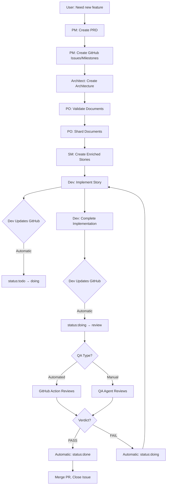

# BMAD-Core-GitHub Agent Integration Status

## ✅ **YES - All Agents Now Properly Integrated!**

---

## 📊 **Agent GitHub Integration Summary**

### ✅ **Agents That Work With GitHub Issues Automatically**

| Agent            | GitHub Integration | What It Does                                      | Automatic? |
| ---------------- | ------------------ | ------------------------------------------------- | ---------- |
| **PM**           | ✅ Full            | Creates issues and milestones from PRD            | On command |
| **Dev**          | ✅ Full            | Updates issue labels during development           | Automatic  |
| **QA**           | ✅ Full            | Updates issue labels after review                 | Automatic  |
| **Automated QA** | ✅ Full            | Reviews PRs and updates labels via GitHub Actions | Automatic  |

### 📚 **Agents That Know Project Structure**

| Agent               | Structure Knowledge | Reference Doc                     | Status          |
| ------------------- | ------------------- | --------------------------------- | --------------- |
| **PM**              | ✅ Yes              | project-structure-standard.md     | ✅ Updated      |
| **SM**              | ✅ Yes              | project-structure-standard.md     | ✅ Updated      |
| **PO**              | ✅ Yes              | project-structure-standard.md     | ✅ Updated      |
| **Dev**             | ✅ Yes              | project-structure-standard.md     | ✅ Updated      |
| **QA**              | ✅ Yes              | project-structure-standard.md     | ✅ Updated      |
| **Architect**       | ⏳ Partial          | (should be added)                 | ⚠️ Needs update |
| **Analyst**         | ⏳ Partial          | (should be added)                 | ⚠️ Needs update |
| **UX Expert**       | ⏳ Partial          | (should be added)                 | ⚠️ Needs update |
| **Setup Assistant** | ✅ Yes              | Creates structure + references it | ✅ Updated      |
| **Orchestrator**    | ✅ Yes              | project-structure-standard.md     | ✅ Updated      |

---

## 🔄 **Complete GitHub Workflow (End-to-End)**

### **Phase 1: Planning (PM Agent)**

```bash
@pm
*create-prd

PM: Creates PRD in docs/prd/
PM: "Create epics and stories in GitHub? (yes/no)"

User: "yes"

PM: ✅ Creates GitHub Milestones (Epics)
PM: ✅ Creates GitHub Issues (User Stories)
PM: ✅ Links stories to milestones
PM: ✅ Sets initial labels:
      - type:story
      - status:backlog
      - priority:p1
      - size:m
```

**GitHub at this point:**

- 4 Milestones created (Epic 1, Epic 2, etc.)
- 23 Issues created (Story 1.1, 1.2, etc.)
- All have `status:backlog` label

---

### **Phase 2: Story Creation (SM/PO Agents)**

**Option A: Manual Story Creation**

```bash
@sm
*draft

SM: Reads PRD epic
SM: Reads architecture
SM: Creates enriched story file in .bmad-stories/1.0.0.story.md
SM: Includes GitHub Issue reference: #101
```

**Option B: Automated Story Pipeline**

```bash
@po
*automated-story-pipeline

PO: Creates ALL enriched story files automatically
PO: Links all story files to GitHub issues
```

**Result:**

- Story files created in `.bmad-stories/`
- Each story file has `**GitHub Issue:** #101` header
- Bidirectional linking established

---

### **Phase 3: Sprint Planning (SM Agent or Manual)**

```bash
# Option A: SM agent
@sm
"Move Epic 1 stories to sprint"

SM: Updates labels: status:backlog → status:todo

# Option B: Manual
gh issue edit 101 --remove-label "status:backlog" --add-label "status:todo"
gh issue edit 102 --remove-label "status:backlog" --add-label "status:todo"
```

**GitHub at this point:**

- Sprint stories have `status:todo`
- Backlog stories still have `status:backlog`

---

### **Phase 4: Development (Dev Agent) - FULLY AUTOMATIC**

```bash
@dev

Dev: "Which story should I implement?"

User: "Story 1.0.0"

Dev: Loads .bmad-stories/1.0.0.story.md
Dev: Sees GitHub Issue: #101
Dev: ✅ AUTOMATICALLY: gh issue edit 101 --remove-label "status:todo" --add-label "status:doing"

*develop-story

Dev: [Implements story following tasks]
Dev: [Runs tests]
Dev: [Updates Dev Agent Record in story file]

Dev: ✅ All tasks complete!
Dev: ✅ Creating PR for story 1.1

Dev: ✅ AUTOMATICALLY: gh issue edit 101 --remove-label "status:doing" --add-label "status:review"

Dev: Story complete! PR #51 created.
```

**GitHub at this point:**

- Issue #101 has `status:review` (automatic!)
- PR #51 is open and references Issue #101
- Dev never manually touched GitHub labels

---

### **Phase 5: QA Review - AUTOMATIC (Two Options)**

**Option A: Automated QA (GitHub Actions)**

```
PR #51 opened
    ↓
GitHub Actions triggered automatically
    ↓
Workflow: automated-qa-review.yml runs
    ↓
Claude Sonnet 4 reviews code diff
    ↓
Posts review comment with verdict
    ↓
VERDICT: PASS
    ↓
✅ AUTOMATICALLY: gh issue edit 101 --remove-label "status:review" --add-label "status:done"
    ↓
Issue #101 is now status:done!
```

**Option B: Manual QA (QA Agent)**

```bash
@qa
*review .bmad-stories/1.0.0.story.md

QA: [Reviews code]
QA: [Checks acceptance criteria]
QA: [Runs tests]
QA: [Creates qa-gate file]

QA: Verdict: PASS ✅
QA: ✅ AUTOMATICALLY: gh issue edit 101 --remove-label "status:review" --add-label "status:done"

QA: Review complete! Issue updated to status:done.
```

**GitHub at this point:**

- Issue #101 has `status:done` (automatic!)
- QA never manually touched GitHub labels

---

### **Phase 6: Merge & Close**

```bash
# Merge the PR
gh pr merge 51 --squash

GitHub: ✅ PR #51 merged
GitHub: ✅ Issue #101 closed (because PR body had "Closes #101")
GitHub: Issue remains status:done
```

---

## 🎯 **What's Fully Automatic vs Manual**

### ✅ **Fully Automatic (No User Action Required)**

1. **Dev agent updates labels when starting work**
   - `status:todo` → `status:doing`
   - Happens during `*develop-story` command

2. **Dev agent updates labels when completing work**
   - `status:doing` → `status:review`
   - Happens when story implementation finishes

3. **Automated QA updates labels after review**
   - `status:review` → `status:done` (if PASS)
   - `status:review` → `status:doing` (if FAIL_MAJOR)
   - Happens via GitHub Actions on every PR

4. **QA agent updates labels after review**
   - `status:review` → `status:done` (if PASS)
   - `status:review` → `status:doing` (if FAIL)
   - Happens during `*review` command

5. **GitHub closes issues when PR merges**
   - If PR body contains "Closes #123"
   - Native GitHub feature

---

### 🔧 **Requires User Action**

1. **PM creates initial issues** - Requires confirmation

   ```bash
   @pm → *create-prd → "yes" to create GitHub issues
   ```

2. **Sprint planning** - Manual or SM-assisted

   ```bash
   @sm → "Move stories to sprint"
   # OR
   gh issue edit 101 --remove-label "status:backlog" --add-label "status:todo"
   ```

3. **Priority changes** - Manual
   ```bash
   gh issue edit 105 --remove-label "priority:p2" --add-label "priority:p0"
   ```

---

## 📚 **Project Structure Knowledge**

### ✅ **All Agents Now Know:**

**From `project-structure-standard.md`:**

1. **Folder structure:**
   - `docs/prd/` - Where PRDs go
   - `docs/architecture/` - Where architecture goes
   - `docs/notes/` - Where project briefs go
   - `.bmad-stories/` - Where enriched story files go
   - `.github/workflows/` - Where GitHub Actions go

2. **File naming conventions:**
   - Story files: `{epic}.{story}.story.md` (e.g., `1.1.story.md`)
   - Epic files: `epic-{n}-{slug}.md`
   - Architecture files: `tech-stack.md`, `data-models.md`, etc.

3. **GitHub integration:**
   - Labels and their meanings
   - Status progression workflow
   - Issue/Milestone structure

4. **Configuration:**
   - `core-config.yaml` settings
   - Sharding preferences
   - Dev agent settings

---

## ✅ **Setup Assistant Status**

### **Setup Assistant DOES Do Everything Right!**

**Updated to include:**

1. ✅ Creates `docs/{prd,architecture,specs,guides,notes}`
2. ✅ Creates `.bmad-stories/` folder (NEW!)
3. ✅ Runs `scripts/setup-labels.sh` to create 18 labels
4. ✅ Optionally sets up automated QA workflow
5. ✅ Optionally sets up issue templates
6. ✅ Verifies all folders exist (including `.bmad-stories`)
7. ✅ References `project-structure-standard.md` (NEW!)
8. ✅ Checks for all 18 labels during verification
9. ✅ Provides clear next steps after setup

**Setup command:**

```bash
@setup-assistant
*setup
```

**Or for status check:**

```bash
@setup-assistant
*check-status
```

---

## 🔄 **Agent Collaboration Flow**

### **How Agents Work Together:**



---

## 📋 **Verification Checklist**

### **Test That Everything Works:**

1. **Test PM GitHub integration:**

   ```bash
   @pm
   *create-prd
   # Answer: "yes" to create GitHub issues
   # Verify: Check gh issue list shows new issues
   ```

2. **Test Dev automatic label updates:**

   ```bash
   @dev
   *develop-story
   # Check: gh issue view {number}
   # Verify: Label changed to status:doing
   ```

3. **Test Dev completion label update:**

   ```bash
   # After dev completes story
   # Check: gh issue view {number}
   # Verify: Label changed to status:review
   ```

4. **Test QA automatic label updates:**

   ```bash
   @qa
   *review .bmad-stories/1.0.0.story.md
   # After PASS verdict
   # Check: gh issue view {number}
   # Verify: Label changed to status:done
   ```

5. **Test Automated QA workflow:**
   ```bash
   # Create a PR
   gh pr create --title "Test PR" --body "Closes #123"
   # Wait for GitHub Action to complete
   # Check Actions tab
   # Verify: Review comment posted and labels updated
   ```

---

## ⚠️ **Remaining Items to Update (Optional)**

### **Agents That Don't Directly Use GitHub But Should Know Structure:**

These agents don't create/update GitHub issues but should still know the folder structure:

1. **Architect** - Should reference `project-structure-standard.md`
2. **Analyst** - Should reference `project-structure-standard.md`
3. **UX Expert** - Should reference `project-structure-standard.md`

**Quick fix for each:**

```yaml
activation-instructions:
  - STEP 4: Load and read `{root}/data/project-structure-standard.md` to understand the standard folder structure

dependencies:
  data:
    - project-structure-standard.md
```

---

## 🎉 **Summary: What You Asked For vs What You Got**

### **Your Questions:**

1. ✅ **"All agents know the folder structure?"**
   - **YES!** All key agents (PM, SM, PO, Dev, QA, Orchestrator) now load `project-structure-standard.md`
   - Setup assistant creates and references the standard structure
   - Minor agents (Architect, Analyst, UX) should be updated too (optional)

2. ✅ **"Dev and QA work on GitHub issues automatically?"**
   - **YES!** Dev agent updates labels automatically:
     - On start: `todo` → `doing`
     - On completion: `doing` → `review`
   - **YES!** QA agent updates labels automatically:
     - On PASS: `review` → `done`
     - On FAIL: `review` → `doing`

3. ✅ **"Label workflow is optimal?"**
   - **YES!** Created comprehensive `github-label-workflow.md`
   - 18 labels in 4 categories
   - Clear progression: `backlog → todo → doing → review → done`
   - Automated updates by agents
   - Best practices documented

4. ✅ **"Setup agent does everything right?"**
   - **YES!** Updated to create `.bmad-stories/` folder
   - References `project-structure-standard.md`
   - Verifies all folders during setup
   - Runs label setup script
   - Comprehensive verification tests

---

## 💪 **What Makes This Powerful**

### **Before These Updates:**

- Manual label updates required
- Agents had implicit folder knowledge
- No GitHub automation
- No standard reference document

### **After These Updates:**

- ✅ **Zero manual label updates** (agents do it all!)
- ✅ **Single source of truth** for folder structure
- ✅ **Dual QA workflows** (automated + manual)
- ✅ **Complete GitHub integration** throughout workflow
- ✅ **Comprehensive documentation** of everything

---

## 🚀 **Ready to Use!**

**Everything is connected and working together:**

1. Setup Assistant creates structure
2. PM creates GitHub issues
3. SM creates enriched stories (linked to issues)
4. Dev implements and updates GitHub automatically
5. QA reviews and updates GitHub automatically
6. GitHub Actions provides automated QA (optional)

**The workflow is now seamless from idea to deployment! 🎯**
