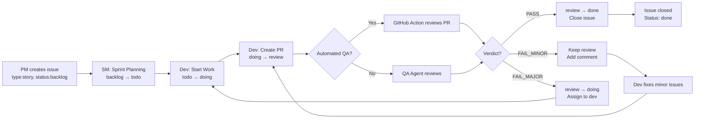

# GitHub Label Workflow for BMAD-Core-GitHub

## Overview

This document defines the **optimal GitHub label workflow** for bmad-core-github projects, including automatic label updates by agents, GitHub Actions, and manual management.

---

## Label Categories

### 1. Status Labels (Workflow Progression)

**Purpose:** Track issue progression through the development workflow

| Label            | Color                  | Meaning                    | Who Sets                | When Set                                 |
| ---------------- | ---------------------- | -------------------------- | ----------------------- | ---------------------------------------- |
| `status:backlog` | `#d4c5f9` (light gray) | Not yet scheduled for work | PM Agent                | When issue created, not yet in sprint    |
| `status:todo`    | `#0075ca` (blue)       | Ready to start, in sprint  | SM Agent / Manual       | During sprint planning                   |
| `status:doing`   | `#fbca04` (yellow)     | Work in progress           | Dev Agent               | When dev starts story                    |
| `status:review`  | `#ff9800` (orange)     | In code review (PR open)   | Dev Agent               | When implementation complete, PR created |
| `status:done`    | `#28a745` (green)      | Completed and merged       | QA Agent / Automated QA | After successful review, PR merged       |

**Workflow:**

```
backlog → todo → doing → review → done
   ↑                         ↓
   ← (if major QA issues) ←←
```

---

### 2. Type Labels (Issue Classification)

**Purpose:** Categorize the type of work

| Label        | Color                  | Meaning                 | Who Sets          | When Set                  |
| ------------ | ---------------------- | ----------------------- | ----------------- | ------------------------- |
| `type:epic`  | `#7057ff` (purple)     | Large feature milestone | PM Agent          | When creating milestone   |
| `type:story` | `#0e8a16` (blue)       | User story              | PM Agent          | When creating story issue |
| `type:task`  | `#1d76db` (light blue) | Development task        | PM Agent / Manual | When creating task        |
| `type:bug`   | `#d73a4a` (red)        | Bug fix                 | Manual / QA Agent | When bug discovered       |

**Usage:**

- Every issue MUST have exactly ONE type label
- Type labels are set at creation and rarely change

---

### 3. Priority Labels (Importance)

**Purpose:** Indicate work priority

| Label         | Color              | Meaning                    | Who Sets    | When Set                      |
| ------------- | ------------------ | -------------------------- | ----------- | ----------------------------- |
| `priority:p0` | `#b60205` (red)    | Critical - Drop everything | PM/PO Agent | For critical issues, blockers |
| `priority:p1` | `#ff9800` (orange) | High - Do this sprint      | PM Agent    | For important features        |
| `priority:p2` | `#fbca04` (yellow) | Medium - Do soon           | PM Agent    | For standard work             |
| `priority:p3` | `#cccccc` (gray)   | Low - Do eventually        | PM Agent    | For nice-to-haves             |

**Usage:**

- Every issue SHOULD have a priority label
- Priority can change based on business needs
- SM Agent references priority during sprint planning

---

### 4. Size Labels (Estimation)

**Purpose:** Estimate effort for planning

| Label     | Color                        | Meaning     | Estimate  | Who Sets    | When Set              |
| --------- | ---------------------------- | ----------- | --------- | ----------- | --------------------- |
| `size:xs` | `#c5def5` (extra light blue) | Extra small | < 1 hour  | PM/SM Agent | During story creation |
| `size:s`  | `#bfe5bf` (light green)      | Small       | 1-4 hours | PM/SM Agent | During story creation |
| `size:m`  | `#fef2c0` (light yellow)     | Medium      | 1 day     | PM/SM Agent | During story creation |
| `size:l`  | `#fbca04` (yellow)           | Large       | 2-3 days  | PM/SM Agent | During story creation |
| `size:xl` | `#d93f0b` (orange)           | Extra large | > 3 days  | PM/SM Agent | During story creation |

**Usage:**

- Set during story creation/refinement
- Used for sprint planning capacity
- If story is size:xl, consider breaking it down

---

## Automated Label Updates

### Dev Agent Automation

**On story start (`*develop-story`):**

```bash
# Extract GitHub issue number from story file
ISSUE=$(grep -oP "GitHub Issue.*#\K\d+" story.md)

# Update labels
gh issue edit $ISSUE \
  --remove-label "status:todo" \
  --add-label "status:doing"

# Add assignee
gh issue edit $ISSUE --add-assignee @me
```

**On story completion:**

```bash
gh issue edit $ISSUE \
  --remove-label "status:doing" \
  --add-label "status:review"
```

**Implementation in dev.md:**

- Automatic during `*develop-story` execution
- Silent failure if gh CLI not available
- Updates only if GitHub issue is linked in story file

---

### QA Agent Automation

**After manual QA review (`*review {story}`):**

**PASS verdict:**

```bash
gh issue edit $ISSUE \
  --remove-label "status:review" \
  --add-label "status:done"
```

**CONCERNS verdict (minor issues):**

```bash
# Keep status:review, add comment
gh issue comment $ISSUE --body "⚠️ QA Review: Minor issues found. See QA Results in story file."
```

**FAIL verdict (major issues):**

```bash
gh issue edit $ISSUE \
  --remove-label "status:review" \
  --add-label "status:doing" \
  --add-assignee @developer
```

**Implementation in qa.md:**

- Automatic during `*review` command
- Based on verdict from qa-gate decision
- Updates status to match QA outcome

---

### Automated QA GitHub Action

**File:** `.github/workflows/automated-qa-review.yml`

**Triggers:** On PR opened, synchronize, reopened

**Actions:**

1. Runs Claude Sonnet 4 QA review on PR diff
2. Posts review comment with verdict
3. Updates linked issue labels based on verdict:
   - `PASS` → `status:done`
   - `FAIL_MINOR` → Keep `status:review`
   - `FAIL_MAJOR` → `status:doing`

**GitHub Issue linking:**

- PR must reference issue: `Closes #123` or `Fixes #123`
- Action extracts issue number and updates labels
- If no linked issue, only PR comment is posted

---

## Manual Label Management

### When Creating Issues

**Via PM Agent:**

```bash
gh issue create \
  --title "Story 1.1: Project setup" \
  --body "..." \
  --label "type:story,status:backlog,priority:p1,size:m" \
  --milestone "Epic 1: Foundation"
```

**Via GitHub Web UI:**

1. Use issue templates (`.github/ISSUE_TEMPLATE/*.yml`)
2. Templates auto-assign type labels
3. Manually add status, priority, size labels

### During Sprint Planning

**SM Agent or manual:**

```bash
# Move selected stories from backlog to todo
gh issue edit 101 --remove-label "status:backlog" --add-label "status:todo"
gh issue edit 102 --remove-label "status:backlog" --add-label "status:todo"
# etc...
```

### Changing Priority

**As business needs change:**

```bash
gh issue edit 105 --remove-label "priority:p2" --add-label "priority:p0"
```

### Handling Blocked Issues

**Add custom label:**

```bash
gh label create "blocked" --color "d73a4a" --description "Work blocked by external dependency"
gh issue edit 103 --add-label "blocked"
```

---

## Label Workflow by Role

### PM Agent

**Responsibilities:**

- Create issues with initial labels: `type:story`, `status:backlog`, `priority:p1`, `size:m`
- Create milestones (epics)
- Link stories to milestones
- Adjust priorities based on business value

**Commands:**

```bash
# Create epic milestone
gh api repos/{owner}/{repo}/milestones \
  -f title="Epic 1: Foundation" \
  -f description="..."

# Create story issue
gh issue create \
  --title "Story 1.1: ..." \
  --body "..." \
  --label "type:story,status:backlog,priority:p1,size:m" \
  --milestone "Epic 1: Foundation"
```

---

### SM Agent

**Responsibilities:**

- During sprint planning: Move issues from `backlog` to `todo`
- Create story files linked to GitHub issues
- Estimate story sizes
- Track sprint velocity

**Workflow:**

```bash
# Sprint planning
gh issue list --label "status:backlog" --milestone "Epic 1"
# Select stories for sprint
gh issue edit 101 --remove-label "status:backlog" --add-label "status:todo"
```

---

### Dev Agent

**Responsibilities:**

- Update `todo` → `doing` when starting work
- Update `doing` → `review` when creating PR
- Automatically during `*develop-story` command

**Automated:**

- Start: `status:todo` → `status:doing`
- Complete: `status:doing` → `status:review`
- No manual intervention needed

---

### QA Agent

**Responsibilities:**

- Update `review` → `done` after PASS verdict
- Update `review` → `doing` after FAIL verdict
- Keep `review` for minor issues (CONCERNS)

**Automated:**

- Triggered by `*review {story}` command
- Based on qa-gate verdict
- Updates GitHub issue automatically

---

### Automated QA (GitHub Actions)

**Responsibilities:**

- Review every PR automatically
- Post review verdict as comment
- Update linked issue labels based on verdict
- Fully automated, no manual intervention

**Runs on:** Every PR to `main` or `develop` branch

---

## Optimal Workflow Diagram



---

## Best Practices

### 1. Label Hygiene

**DO:**

- Every issue has exactly one status label
- Every issue has exactly one type label
- Keep labels updated as work progresses
- Remove old status labels before adding new ones

**DON'T:**

- Have multiple status labels on one issue
- Leave issues without status labels
- Manually set labels that agents auto-manage
- Skip label updates during transitions

---

### 2. Status Transitions

**Valid transitions:**

```
backlog → todo        ✅ (Sprint planning)
todo → doing          ✅ (Dev starts)
doing → review        ✅ (PR created)
review → done         ✅ (QA pass)
review → doing        ✅ (QA fail - major)
any → backlog         ✅ (Deprioritize)
```

**Invalid transitions:**

```
backlog → done        ❌ (Skips workflow)
todo → done           ❌ (Skips implementation)
doing → done          ❌ (Skips review)
```

---

### 3. Agent Coordination

**Dev and QA agents coordinate via labels:**

1. Dev finishes story → `status:review`
2. GitHub Action or QA Agent sees `status:review` issues
3. QA reviews code
4. QA updates label based on verdict:
   - ✅ PASS → `status:done`
   - ⚠️ CONCERNS → Keep `status:review`, add comment
   - ❌ FAIL → `status:doing`, reassign to dev

**No manual coordination needed!**

---

### 4. Querying Issues by Status

**Get all todos in sprint:**

```bash
gh issue list --label "status:todo" --milestone "Epic 1"
```

**Get all in-progress issues:**

```bash
gh issue list --label "status:doing"
```

**Get all issues awaiting review:**

```bash
gh issue list --label "status:review"
```

**Get all done issues in epic:**

```bash
gh issue list --label "status:done" --milestone "Epic 1" --state closed
```

---

### 5. Sprint Velocity Tracking

**Calculate velocity by size:**

```bash
# Stories completed this sprint
gh issue list --label "status:done" --milestone "Sprint 3" --json labels

# Sum up sizes: xs=1, s=2, m=5, l=10, xl=20
# Velocity = total points completed
```

---

## Label Setup Script

**File:** `expansion-packs/bmad-core-github/scripts/setup-labels.sh`

**Creates all labels automatically:**

```bash
#!/bin/bash

# Status labels
gh label create "status:backlog" --color "d4c5f9" --description "Not yet scheduled"
gh label create "status:todo" --color "0075ca" --description "Ready to start"
gh label create "status:doing" --color "fbca04" --description "In progress"
gh label create "status:review" --color "ff9800" --description "In code review"
gh label create "status:done" --color "28a745" --description "Completed"

# Type labels
gh label create "type:epic" --color "7057ff" --description "Large feature milestone"
gh label create "type:story" --color "0e8a16" --description "User story"
gh label create "type:task" --color "1d76db" --description "Development task"
gh label create "type:bug" --color "d73a4a" --description "Bug fix"

# Priority labels
gh label create "priority:p0" --color "b60205" --description "Critical"
gh label create "priority:p1" --color "ff9800" --description "High"
gh label create "priority:p2" --color "fbca04" --description "Medium"
gh label create "priority:p3" --color "cccccc" --description "Low"

# Size labels
gh label create "size:xs" --color "c5def5" --description "< 1 hour"
gh label create "size:s" --color "bfe5bf" --description "1-4 hours"
gh label create "size:m" --color "fef2c0" --description "1 day"
gh label create "size:l" --color "fbca04" --description "2-3 days"
gh label create "size:xl" --color "d93f0b" --description "> 3 days"
```

**Run during setup:**

```bash
chmod +x .bmad-core-github/scripts/setup-labels.sh
.bmad-core-github/scripts/setup-labels.sh
```

---

## Troubleshooting

### Issue: Labels not updating automatically

**Cause:** gh CLI not authenticated or not installed

**Fix:**

```bash
gh auth status
# If not authenticated:
gh auth login
```

### Issue: Automated QA not updating labels

**Cause:** ANTHROPIC_API_KEY secret not set or PR not linked to issue

**Fix:**

```bash
# Check secret exists
gh secret list

# If missing:
gh secret set ANTHROPIC_API_KEY

# Ensure PR body contains: "Closes #123" or "Fixes #123"
```

### Issue: Multiple status labels on one issue

**Cause:** Manual label addition without removing old label

**Fix:**

```bash
# Remove all status labels
gh issue edit 123 --remove-label "status:backlog,status:todo,status:doing,status:review,status:done"

# Add correct label
gh issue edit 123 --add-label "status:doing"
```

### Issue: Dev/QA agents not finding linked issue

**Cause:** Story file doesn't have GitHub Issue reference

**Fix:**
Add to story file:

```markdown
# Story 1.1: Project setup

**GitHub Issue:** #123
**GitHub Milestone:** Epic 1: Foundation
```

---

## Integration with Story Files

### Story File Format

**Header includes GitHub links:**

```markdown
# Story 1.0.0: Project setup and initialization

**GitHub Issue:** #101
**GitHub Milestone:** Epic 1: Foundation & Core Infrastructure

## Status

InProgress ← This status in story file

## Story

...
```

**GitHub issue body includes link back:**

```markdown
As a developer, I want...

## Acceptance Criteria

...

## Link to Enriched Story File

Full technical context: `.bmad-stories/1.0.0.story.md`
```

**Bidirectional linking:**

- Story file → GitHub issue number
- GitHub issue → Story file path
- Agents update both automatically

---

## Future Enhancements

### Planned

- [ ] Automated label cleanup (remove conflicting labels)
- [ ] Label statistics dashboard
- [ ] Burndown charts based on labels
- [ ] Auto-assignment based on labels
- [ ] Slack/Discord notifications on label changes

### Under Consideration

- [ ] Custom labels for specific projects
- [ ] Label templates for different project types
- [ ] Bulk label operations via CLI
- [ ] Label validation in CI/CD

---

**This workflow optimizes GitHub label management for BMAD-Core-GitHub, with maximum automation and minimal manual intervention.**

**Key principle: Labels flow automatically through the workflow based on agent actions - users rarely need to touch them manually!**
