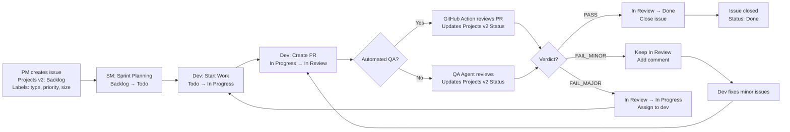

# GitHub Workflow for BMAD-Core-GitHub (Projects v2 + Labels)

## Overview

This document defines the **optimal GitHub workflow** for bmad-core-github projects, combining:

1. **GitHub Projects v2 Status Fields** (PRIMARY) - For workflow tracking (Backlog → Todo → In Progress → In Review → Done)
2. **GitHub Labels** (SECONDARY) - For categorization (type, priority, size) and status fallback

### Why This Hybrid Approach?

**Projects v2 Status Fields:**

- ✅ Single-select enforcement (only one status at a time)
- ✅ Native kanban board integration
- ✅ Automatic card movement when status changes
- ✅ Structured workflow state machine
- ✅ Cross-repository project support

**Labels for Metadata:**

- ✅ Issue categorization (type: story, bug, epic, task)
- ✅ Priority management (p0-p3)
- ✅ Size estimation (xs-xl)
- ✅ Filtering and searching
- ✅ Backward compatibility (fallback for status)

**Key Principle:** Status flows through Projects v2 Status fields automatically. Labels provide metadata and serve as fallback when Projects v2 is unavailable.

---

## Status Tracking (Projects v2 Primary)

### Workflow Status Values

| Status          | Meaning                    | Color (Kanban) | Who Updates             | When Updated                             |
| --------------- | -------------------------- | -------------- | ----------------------- | ---------------------------------------- |
| **Backlog**     | Not yet scheduled for work | Gray           | PM/SM Agent             | When issue created, not yet in sprint    |
| **Todo**        | Ready to start, in sprint  | Blue           | SM Agent                | During sprint planning                   |
| **In Progress** | Work in progress           | Yellow         | Dev Agent               | When dev starts story                    |
| **In Review**   | In code review (PR open)   | Orange         | Dev Agent               | When implementation complete, PR created |
| **Done**        | Completed and merged       | Green          | QA Agent / Automated QA | After successful review, PR merged       |

### Status Workflow

```
Backlog → Todo → In Progress → In Review → Done
   ↑                              ↓
   ← (if major QA issues found) ←←
```

### How Agents Update Status

All BMAD agents use this pattern:

**PRIMARY:** Try Projects v2 status update using helper script

```bash
{root}/scripts/update-project-status.sh {issue-number} "In Progress"
```

**FALLBACK:** If Projects v2 unavailable or fails, use labels

```bash
gh issue edit {issue-number} --remove-label "status:todo" --add-label "status:doing"
```

**Automatic Fallback:** The helper script auto-detects configuration and falls back to labels if:

- Projects v2 not configured in `core-config.yaml`
- GitHub CLI not authenticated with `project` scope
- Project or issue not found
- Any API errors

---

## Label Categories (Metadata)

### 1. Type Labels (Issue Classification)

**Purpose:** Categorize the type of work

| Label        | Color                  | Meaning                 | Who Sets          | When Set                  |
| ------------ | ---------------------- | ----------------------- | ----------------- | ------------------------- |
| `type:epic`  | `#7057ff` (purple)     | Large feature milestone | PM Agent          | When creating milestone   |
| `type:story` | `#0e8a16` (green)      | User story              | PM/SM Agent       | When creating story issue |
| `type:task`  | `#1d76db` (light blue) | Development task        | PM Agent / Manual | When creating task        |
| `type:bug`   | `#d73a4a` (red)        | Bug fix                 | Manual / QA Agent | When bug discovered       |

**Usage:**

- Every issue MUST have exactly ONE type label
- Type labels are set at creation and rarely change

---

### 2. Priority Labels (Importance)

**Purpose:** Indicate work priority

| Label         | Color              | Meaning                    | Who Sets    | When Set                      |
| ------------- | ------------------ | -------------------------- | ----------- | ----------------------------- |
| `priority:p0` | `#b60205` (red)    | Critical - Drop everything | PM/PO Agent | For critical issues, blockers |
| `priority:p1` | `#ff9800` (orange) | High - Do this sprint      | PM Agent    | For important features        |
| `priority:p2` | `#fbca04` (yellow) | Medium - Do soon           | PM Agent    | For standard work             |
| `priority:p3` | `#cccccc` (gray)   | Low - Do eventually        | PM Agent    | For nice-to-haves             |

**Usage:**

- Every issue SHOULD have a priority label
- Priority can change based on business needs
- SM Agent references priority during sprint planning

---

### 3. Size Labels (Estimation)

**Purpose:** Estimate effort for planning

| Label     | Color                        | Meaning     | Estimate  | Who Sets    | When Set              |
| --------- | ---------------------------- | ----------- | --------- | ----------- | --------------------- |
| `size:xs` | `#c5def5` (extra light blue) | Extra small | < 1 hour  | PM/SM Agent | During story creation |
| `size:s`  | `#bfe5bf` (light green)      | Small       | 1-4 hours | PM/SM Agent | During story creation |
| `size:m`  | `#fef2c0` (light yellow)     | Medium      | 1 day     | PM/SM Agent | During story creation |
| `size:l`  | `#fbca04` (yellow)           | Large       | 2-3 days  | PM/SM Agent | During story creation |
| `size:xl` | `#d93f0b` (orange)           | Extra large | > 3 days  | PM/SM Agent | During story creation |

**Usage:**

- Set during story creation/refinement
- Used for sprint planning capacity
- If story is size:xl, consider breaking it down

---

### 4. Status Labels (Fallback Only)

**Purpose:** Fallback for status when Projects v2 unavailable

| Label            | Color                  | Meaning                    |
| ---------------- | ---------------------- | -------------------------- |
| `status:backlog` | `#d4c5f9` (light gray) | Not yet scheduled for work |
| `status:todo`    | `#0075ca` (blue)       | Ready to start, in sprint  |
| `status:doing`   | `#fbca04` (yellow)     | Work in progress           |
| `status:review`  | `#ff9800` (orange)     | In code review (PR open)   |
| `status:done`    | `#28a745` (green)      | Completed and merged       |

**⚠️ Status labels are maintained for backward compatibility but are secondary to Projects v2 Status fields.**

---

## Automated Status Updates

### Dev Agent Automation

**On story start (`*develop-story`):**

**PRIMARY - Projects v2:**

```bash
# Extract GitHub issue number from story file
ISSUE=$(grep -oP "GitHub Issue.*#\K\d+" story.md)

# Update Projects v2 status
./expansion-packs/bmad-core-github/scripts/update-project-status.sh $ISSUE "In Progress"
```

**FALLBACK - Labels:**

```bash
gh issue edit $ISSUE \
  --remove-label "status:todo" \
  --add-label "status:doing"
```

**On story completion:**

**PRIMARY - Projects v2:**

```bash
./expansion-packs/bmad-core-github/scripts/update-project-status.sh $ISSUE "In Review"
```

**FALLBACK - Labels:**

```bash
gh issue edit $ISSUE \
  --remove-label "status:doing" \
  --add-label "status:review"
```

**Implementation in dev.md:**

- Automatic during `*develop-story` execution
- Tries Projects v2 first, falls back to labels
- Silent failure if neither available
- Updates only if GitHub issue is linked in story file

---

### QA Agent Automation

**After manual QA review (`*review {story}`):**

**PASS verdict:**

**PRIMARY - Projects v2:**

```bash
./expansion-packs/bmad-core-github/scripts/update-project-status.sh $ISSUE "Done"
```

**FALLBACK - Labels:**

```bash
gh issue edit $ISSUE \
  --remove-label "status:review" \
  --add-label "status:done"
```

**CONCERNS verdict (minor issues):**

```bash
# Keep status at "In Review", add comment
gh issue comment $ISSUE --body "⚠️ QA Review: Minor issues found. See QA Results in story file."
```

**FAIL verdict (major issues):**

**PRIMARY - Projects v2:**

```bash
./expansion-packs/bmad-core-github/scripts/update-project-status.sh $ISSUE "In Progress"
```

**FALLBACK - Labels:**

```bash
gh issue edit $ISSUE \
  --remove-label "status:review" \
  --add-label "status:doing" \
  --add-assignee @developer
```

**Implementation in qa.md:**

- Automatic during `*review` command
- Based on verdict from qa-gate decision
- Tries Projects v2 first, falls back to labels
- Updates status to match QA outcome

---

### SM Agent Automation

**When creating stories from PRD:**

**PRIMARY - Projects v2:**

```bash
./expansion-packs/bmad-core-github/scripts/update-project-status.sh $ISSUE "Backlog"
```

**FALLBACK - Labels:**

```bash
gh issue edit $ISSUE --add-label "status:backlog"
```

**During sprint planning (moving to sprint):**

**PRIMARY - Projects v2:**

```bash
./expansion-packs/bmad-core-github/scripts/update-project-status.sh $ISSUE "Todo"
```

**FALLBACK - Labels:**

```bash
gh issue edit $ISSUE --remove-label "status:backlog" --add-label "status:todo"
```

---

### PM Agent Automation

**When creating issues (epics, stories):**

**PRIMARY - Projects v2:**

```bash
./expansion-packs/bmad-core-github/scripts/update-project-status.sh $ISSUE "Backlog"
```

**FALLBACK - Labels:**

```bash
gh issue edit $ISSUE --add-label "status:backlog"
```

---

### Automated QA GitHub Action

**File:** `.github/workflows/automated-qa-review.yml`

**Triggers:** On PR opened, synchronize, reopened

**Actions:**

1. Runs Claude Sonnet 4 QA review on PR diff
2. Posts review comment with verdict
3. Updates linked issue status based on verdict:
   - **PRIMARY:** Updates Projects v2 Status field using helper script
   - **FALLBACK:** Updates status labels if Projects v2 fails
4. Verdict mapping:
   - `PASS` → "Done"
   - `FAIL_MINOR` → Keep "In Review"
   - `FAIL_MAJOR` → "In Progress"

**GitHub Issue linking:**

- PR must reference issue: `Closes #123` or `Fixes #123`
- Action extracts issue number and updates status
- If no linked issue, only PR comment is posted

---

## Setup

### 1. Setup GitHub Projects v2 (Recommended)

**Run the initialization script:**

```bash
chmod +x ./expansion-packs/bmad-core-github/scripts/init-github-project.sh
./expansion-packs/bmad-core-github/scripts/init-github-project.sh
```

**What this does:**

1. Creates a new GitHub Project for your repository
2. Retrieves all necessary IDs (project ID, status field ID, option IDs)
3. Updates `.bmad-core/core-config.yaml` with project configuration
4. Caches IDs for fast status updates

**Configuration created in core-config.yaml:**

```yaml
github:
  projects:
    enabled: true
    project_number: 1
    owner: 'your-org-or-username'

    status_field:
      name: 'Status'

    cache:
      project_id: 'PVT_kwDOABCDEF...'
      status_field_id: 'PVTF_lADOABCDEF...'
      backlog_option_id: '...'
      todo_option_id: '...'
      inprogress_option_id: '...'
      inreview_option_id: '...'
      done_option_id: '...'
```

---

### 2. Setup GitHub Labels (Required for Metadata)

**Run the label creation script:**

```bash
chmod +x ./expansion-packs/bmad-core-github/scripts/setup-labels.sh
./expansion-packs/bmad-core-github/scripts/setup-labels.sh
```

**Creates labels for:**

- Type (epic, story, task, bug)
- Priority (p0-p3)
- Size (xs-xl)
- Status (backlog, todo, doing, review, done) - fallback only

---

## Querying Issues

### By Projects v2 Status

**Via GitHub Projects UI:**

1. Navigate to your project: `https://github.com/users/{owner}/projects/{number}`
2. Use built-in filters for Status field
3. Drag cards between columns to update status

**Via gh CLI:**

```bash
# List all issues in project
gh project item-list {project-number} --owner {owner} --format json

# Filter by status using jq
gh project item-list 1 --owner myorg --format json | \
  jq '.items[] | select(.fieldValues.status=="In Progress")'
```

### By Labels (Alternative)

**Get all todos in sprint:**

```bash
gh issue list --label "status:todo" --milestone "Epic 1"
```

**Get all in-progress issues:**

```bash
gh issue list --label "status:doing"
```

**Get all issues awaiting review:**

```bash
gh issue list --label "status:review"
```

**Get all done issues in epic:**

```bash
gh issue list --label "status:done" --milestone "Epic 1" --state closed
```

---

## Workflow Diagram



---

## Best Practices

### 1. Status Hygiene

**DO:**

- Let agents manage status automatically (Projects v2 enforces single status)
- Use Projects v2 kanban board for visual workflow tracking
- Keep Projects v2 enabled in core-config.yaml
- Use labels for categorization (type, priority, size)

**DON'T:**

- Manually update Projects v2 status when agents are running
- Disable Projects v2 without ensuring label fallback works
- Mix manual and automated status updates

---

### 2. Status Transitions

**Valid transitions:**

```
Backlog → Todo           ✅ (Sprint planning)
Todo → In Progress       ✅ (Dev starts)
In Progress → In Review  ✅ (PR created)
In Review → Done         ✅ (QA pass)
In Review → In Progress  ✅ (QA fail - major)
any → Backlog            ✅ (Deprioritize)
```

**Invalid transitions:**

```
Backlog → Done                ❌ (Skips workflow)
Todo → Done                   ❌ (Skips implementation)
In Progress → Done            ❌ (Skips review)
```

---

### 3. Projects v2 vs Labels - When to Use What

**Use Projects v2 Status For:**

- Workflow state (Backlog → Todo → In Progress → In Review → Done)
- Tracking where an issue is in the development lifecycle
- Kanban board visualization
- Single-source-of-truth for status

**Use Labels For:**

- Issue type (`type:story`, `type:bug`, `type:epic`, `type:task`)
- Priority (`priority:p0`, `priority:p1`, `priority:p2`, `priority:p3`)
- Size estimation (`size:xs`, `size:s`, `size:m`, `size:l`, `size:xl`)
- Filtering and categorization
- Status fallback when Projects v2 unavailable

---

### 4. Sprint Velocity Tracking

**Calculate velocity by size:**

```bash
# Stories completed this sprint
gh issue list --label "status:done" --milestone "Sprint 3" --json labels

# Sum up sizes: xs=1, s=2, m=5, l=10, xl=20
# Velocity = total points completed
```

**Or use Projects v2 built-in features:**

- Create custom "Velocity" field (number type)
- Sum completed stories by size
- Track sprint burndown automatically

---

## Troubleshooting

### Issue: Projects v2 status not updating

**Cause:** Projects v2 not configured or gh CLI not authenticated with project scope

**Fix:**

```bash
# Check if core-config.yaml has Projects v2 configuration
cat .bmad-core/core-config.yaml | grep -A 10 "projects:"

# Ensure gh CLI has project scope
gh auth status
# If project scope missing:
gh auth refresh -s project

# Test helper script manually
./expansion-packs/bmad-core-github/scripts/update-project-status.sh 123 "In Progress"
```

---

### Issue: Agents falling back to labels

**Cause:** Normal behavior when Projects v2 unavailable

**Fix:**
This is expected fallback behavior. To use Projects v2:

1. Run `init-github-project.sh` to set up Projects v2
2. Verify configuration in `.bmad-core/core-config.yaml`
3. Ensure gh CLI authenticated: `gh auth refresh -s project`

---

### Issue: Label and Projects v2 status out of sync

**Cause:** Manual updates or API errors

**Fix:**

Projects v2 is the source of truth. Update manually:

```bash
# Update Projects v2 (will also update labels if script configured)
./expansion-packs/bmad-core-github/scripts/update-project-status.sh 123 "In Progress"
```

Or update Projects v2 via kanban board (drag card to correct column).

---

### Issue: Automated QA not updating status

**Cause:** ANTHROPIC_API_KEY secret not set or PR not linked to issue

**Fix:**

```bash
# Check secret exists
gh secret list

# If missing:
gh secret set ANTHROPIC_API_KEY

# Ensure PR body contains: "Closes #123" or "Fixes #123"
```

---

### Issue: Helper script not found in GitHub Actions

**Cause:** Workflow not checking out code or incorrect path

**Fix:**

Ensure workflow has checkout step:

```yaml
- name: Checkout code
  uses: actions/checkout@v4
```

And helper script path is correct:

```yaml
- name: Update status
  run: |
    ./expansion-packs/bmad-core-github/scripts/update-project-status.sh $ISSUE "Done"
```

---

## Integration with Story Files

### Story File Format

**Header includes GitHub links:**

```markdown
# Story 1.0.0: Project setup and initialization

**GitHub Issue:** #101
**GitHub Milestone:** Epic 1: Foundation & Core Infrastructure
**Projects v2 Status:** In Progress

## Status

InProgress ← This status in story file

## Story

...
```

**GitHub issue body includes link back:**

```markdown
As a developer, I want...

## Acceptance Criteria

...

## Link to Enriched Story File

Full technical context: `.bmad-stories/1.0.0.story.md`
```

**Bidirectional linking:**

- Story file → GitHub issue number
- GitHub issue → Story file path
- Projects v2 Status → Visible in project board
- Agents update all three automatically

---

## Migration from Labels-Only

If you're using an existing bmad-core-github project with label-based status:

### Step 1: Set up Projects v2

```bash
./expansion-packs/bmad-core-github/scripts/init-github-project.sh
```

### Step 2: Migrate existing issues (optional)

```bash
# Add all open issues to project
gh issue list --state open --json number --jq '.[].number' | while read issue; do
  # Helper script will add to project and set status based on label
  ./expansion-packs/bmad-core-github/scripts/update-project-status.sh $issue "Backlog"
done
```

### Step 3: No code changes needed

All agents already support Projects v2 with automatic label fallback. They will:

- Try Projects v2 first
- Fall back to labels if Projects v2 unavailable
- Work seamlessly in both modes

---

## Future Enhancements

### Planned

- [ ] Automated sync between Projects v2 and labels
- [ ] Custom fields (effort, complexity, risk)
- [ ] Sprint iteration tracking in Projects v2
- [ ] Velocity charts using Projects v2 data
- [ ] Cross-repository project support

### Under Consideration

- [ ] Multiple project support (per epic or team)
- [ ] Project templates for different workflows
- [ ] Automated issue archival
- [ ] Integration with other project management tools

---

## Summary

**BMAD-Core-GitHub uses a hybrid approach:**

1. **Projects v2 Status Fields** (PRIMARY)
   - Single source of truth for workflow status
   - Automatic kanban board updates
   - Enforces single-select status

2. **Labels** (METADATA + FALLBACK)
   - Issue categorization (type, priority, size)
   - Status fallback when Projects v2 unavailable
   - Filtering and searching

**Key Principle:** Status flows automatically through Projects v2. Agents handle all updates. Users rarely need manual intervention!

For setup guidance, see **Setup Assistant**: `@setup-assistant *setup-projects`

For detailed analysis: `expansion-packs/bmad-core-github/PROJECTS-VS-LABELS-ANALYSIS.md`
